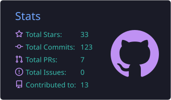
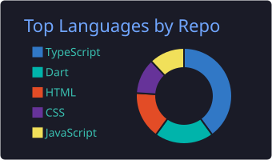
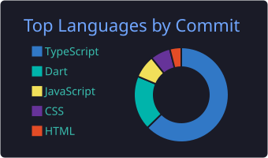
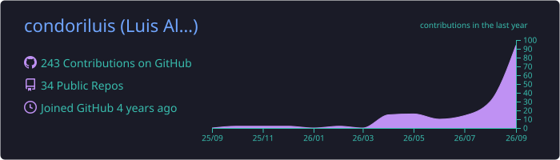
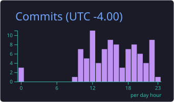

 

---

## Sobre mí

Ingeniero de Sistemas y Desarrollador Full Stack con más de **8 años de experiencia** construyendo aplicaciones web, plataformas SaaS, dashboards empresariales, sistemas de automatización y soluciones de Inteligencia Artificial.

📍 La Paz, Bolivia

**Enfoque actual:**

- Inteligencia Artificial y Agentes IA
- Automatización y Chatbots Multicanal
- Business Intelligence & Analytics
- Plataformas SaaS Multi-Tenant
- Arquitecturas Full Stack Modernas
- DevOps y Automatización

---

## GitHub Analytics

---

## Tech Stack

**Languages**

**Frontend & Mobile**

**Backend & APIs**

**Databases & DevOps**

---

## Proyectos Destacados

| Proyecto | Descripción | Stars | Lenguaje principal |
| --- | --- | --- | --- |
| [**gestor-tareas**](https://github.com/condoriluis/gestor-tareas) | Gestor de tareas con Next.js, React y TypeScript |  |  |
| [**fms-bo**](https://github.com/condoriluis/fms-bo) | File Manager System con Next.js, React, TypeScript y shadcn/ui |  |  |
| [**dev-retos**](https://github.com/condoriluis/dev-retos) | App móvil de retos de programación con gamificación y rankings |  |  |
| [**app-secure-vault**](https://github.com/condoriluis/app-secure-vault) | Gestor de credenciales con cifrado Zero-Knowledge |  |  |
| [**dashboards-vuejs**](https://github.com/condoriluis/dashboards-vuejs) | Dashboards dinámicos con Vue.js, Vuetify y Chart.js |  |  |
| [**sistema-registro-usuarios**](https://github.com/condoriluis/sistema-registro-usuarios) | Gestión de usuarios con roles y permisos |  |  |

### Case Studies — proyectos en entornos productivos

| Proyecto | Descripción | Stack |
| --- | --- | --- |
| **BotFlow** — Multi-Channel Chatbot Platform | Plataforma SaaS multi-tenant para automatización empresarial vía WhatsApp, Telegram y web widgets | Next.js · NestJS · PostgreSQL · Prisma · Socket.IO |
| **BI Dashboard Intelligence** | Sistema empresarial de Business Intelligence con dashboards dinámicos, consultas SQL y visualización avanzada de datos | Next.js · FastAPI · DuckDB · ApexCharts |
| **AI Studio** | Plataforma para construcción de agentes inteligentes y automatización mediante flujos visuales | Next.js · Python · FastAPI · LLMs |
| **Cloud File Manager** | Sistema empresarial para gestión documental y almacenamiento en la nube | Next.js · AWS S3 · Cloudinary · Supabase |

---

## Experiencia Profesional

**Software Developer** — Strategic Bolivia
📅 2024 – 2025

- Desarrollo backend y frontend de aplicaciones empresariales
- Diseño y optimización de bases de datos
- APIs RESTful y documentación técnica con Swagger

**Systems Developer & Technical Support** — Ministerio de Desarrollo Productivo y Economía Plural
📅 2021 – 2024

- Desarrollo de sistemas institucionales
- Administración de infraestructura, seguridad y respaldos
- Soporte técnico especializado

---

## Contacto

📧 [luis.condori.dev@gmail.com](mailto:luis.condori.dev@gmail.com) · 💼 [linkedin.com/in/condoriluis](https://www.linkedin.com/in/condoriluis) · 🌐 [luis-portafolio.vercel.app](https://luis-portafolio.vercel.app) · 📝 [miblogi.vercel.app](https://miblogi.vercel.app)

---

